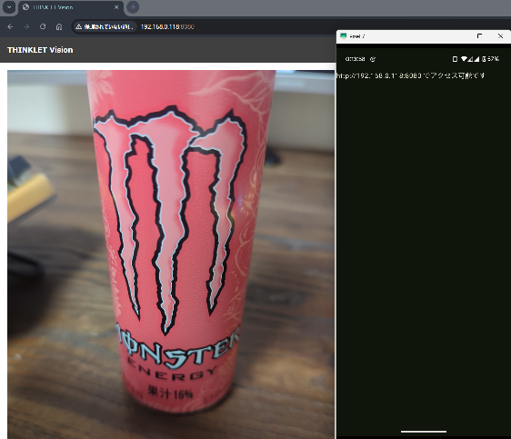

# THINKLET Vision
インターネット接続を必要とせずに THINKLET/Androidのカメラをブラウザから視るサンプルアプリ

> [!TIP]
> このアプリでは，カメラ映像取得のために CameraXの`画像解析ユースケース` を利用しています．
> 利用のイメージとしては，`VideoCapureユースケース` を実行しながら，本機能を用いることで，録画をしながら視点を別デバイスのブラウザから視ることができます．

## 準備
- アプリの動作のために，CameraのPermissionを付与してください．
- THINKLETと，PCやスマホなど閲覧するデバイスを同じネットワーク，Wi-Fiルーター配下に接続してください．
- アプリ上に表示されるURLに他のデバイスからアクセスします．

## 動作実績
- THINKLET LC01 （ファームウェアバージョン 11.001.0）
- Pixel7 (Android 14, 15)
