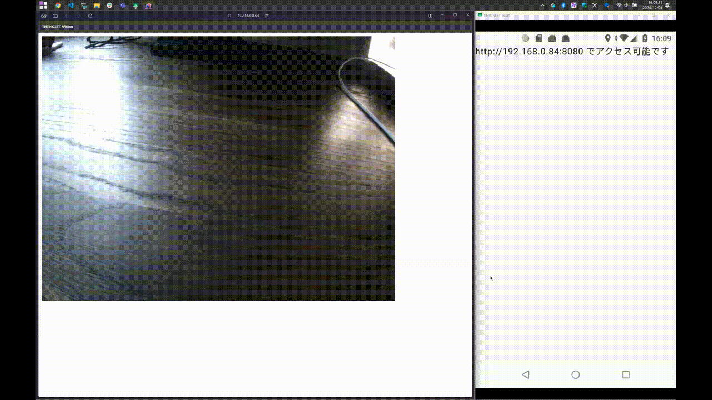

# THINKLET Vision
THINKLET/Androidのカメラを別デバイスのブラウザから視るサンプルアプリ

> [!TIP]
> このアプリでは，カメラ映像取得のために CameraXの`画像解析ユースケース` を利用しています．
> 利用のイメージとしては，`VideoCapureユースケース` を実行しながら，本サンプル実装を用いることで，録画をしながらカメラ映像を別デバイスのブラウザから視ることができます．

## 実行手順
1. 本リポジトリをCloneします
2. インストールする実機とPCを接続し，プロジェクトのルートで， `./gradlew installDebug` を実行します
    - Android Studioでも同じことができますが，バージョンや環境によって正しく読み込めない場合があります
3. （THINKLETの場合）画面をPCに表示するために，[scrcpy](https://github.com/Genymobile/scrcpy) を使用します．
4. アプリ起動前に，事前に設定アプリから，このアプリのCameraへのPermissionを許可してください．
5. THINKLETあるいはAndroidと，PCなどブラウザで閲覧するデバイスを同一ネットワーク上に接続してください．
6. アプリ上に表示されるURLに他のデバイスのブラウザからアクセスします．

## 動作実績
- THINKLET LC01 （ファームウェアバージョン 11.001.0）
- Pixel7 (Android 14, 15)
