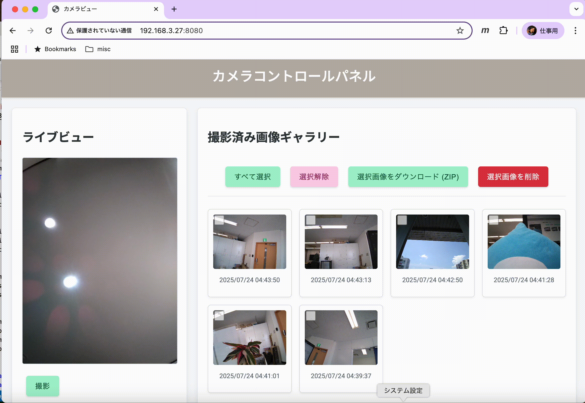

# THINKLET Photo Viewer
このプロジェクトは、[THINKLET Vision](https://github.com/FairyDevicesRD/thinklet.camerax.vision)をフォークし機能拡張しています。
Androidデバイスのカメラをリモートで操作し、撮影された画像をWebブラウザ経由で確認・管理するためのアプリケーションです。
THINKLET Visionライブラリの機能を活用し、THINKLETやAndroidデバイス上でHTTPサーバーを起動してWeb UIを提供します。

## 概要
THINKLETを高度なネットワークカメラシステムとして活用できます。PCやスマートフォンのWebブラウザから、同一ネットワーク内のTHINKLETにアクセスし、以下の操作が可能です。

*   カメラ映像をリアルタイムで表示(以降、ライブビューと呼びます）
*   静止画撮影
*   動画撮影の開始・停止
*   撮影済み画像のインタラクティブなギャラリー表示
*   画像の個別表示・ダウンロード
*   複数画像の選択とZIP形式での一括ダウンロード
*   複数画像の選択と削除
*   本アプリ内からのカメラ初期回転設定

## 開発に至った経緯
thinklet.camerax.visionにはTHINKLET上でHTTPサーバーを動作させてカメラの画像を配信するという仕組みがあります。これの応用例として、PCやスマートフォンのWebブラウザ経由で画像を見るだけではなくカメラ制御もできるサンプルが有用だと考え、本アプリを実装しました。

## 特徴

*   **リアルタイムライブビュー:** Webブラウザ上でカメラの映像をリアルタイムに確認できます。
*   **リモートカメラ操作:** ブラウザから直接、写真撮影やビデオ録画のコントロールが可能です。
*   **インタラクティブな画像ギャラリー:**
    *   撮影された画像がサムネイルで一覧表示されます。
    *   画像は撮影日時の新しい順にソートされます。
    *   各画像には撮影日時が表示されます。
    *   サムネイルクリックで画像をモーダルウィンドウに拡大表示できます。
*   **効率的な画像管理:**
    *   複数の画像を選択し、一括でZIPファイルとしてダウンロードできます。
    *   不要な画像を複数選択して一括で削除できます。
*   **柔軟なカメラ設定:** デバイスの向きや設置状況に合わせて、本アプリ内の設定画面からカメラ映像の初期回転を簡単に調整可能です。
*   **レスポンシブWebデザイン:** PC、タブレット、スマートフォンなど、様々なデバイスの画面サイズに対応したUIを提供します。
*   **シンプルなセットアップ:** 本アプリを起動するだけで、Webサーバーが利用可能になります。

## 技術スタック

*   **Android:**
    *   Kotlin
    *   CameraX (カメラ機能)
    *   Koin (DIコンテナ)
    *   Jetpack Compose (設定画面UI)
    *   Android ViewModel
*   **Webサーバー (本アプリ内蔵):**
    *   Ktor (軽量HTTPサーバーフレームワーク)
    *   Kotlinx Serialization (JSON処理)
*   **Webフロントエンド (Web UI):**
    *   HTML5
    *   CSS3 (Flexbox, Grid Layout を利用したレスポンシブデザイン)
    *   JavaScript (DOM操作、サーバーとの非同期通信 (Fetch API))

## 開発時に使用したIDE
Android Studio Narwhal | 2025.1.1 Canary 7

## セットアップと使用方法

1.  **本アプリのビルドとインストール:**
    *   このリポジトリをクローンします: `git clone [リポジトリURL]`
    *   Android Studioでプロジェクトを開きます。
    *   対象のAndroidデバイスにアプリをビルドし、インストールします。
または、
[実行手順](https://github.com/FairyDevicesRD/thinklet.camerax.vision?tab=readme-ov-file#%E5%AE%9F%E8%A1%8C%E6%89%8B%E9%A0%86)
を参照してください。
      
2.  **アプリの起動と初期設定:**
    *   インストールされたアプリをAndroidデバイスで起動します。
    *   （THINKLETの場合）画面をPCに表示するために，scrcpy を使用します．
    *   起動された画面に権限設定のためのボタンが表示されるので、このアプリのCameraへのPermissionを許可してください。
    *   THINKLETと、PCなどブラウザで閲覧するデバイスを同一ネットワーク上に接続してください。

    *   **カメラの初期回転設定:**
    *   メイン画面にある設定アイコンをタップして、「設定」画面に移動します。
    *   「設定」画面には「カメラ初期回転設定」という項目があります。
    *   ドロップダウンメニューをタップし、デバイスの向きや期待する画像の向きに合わせて、回転オプション（例: 「0° (ポートレート)」、「90° (横向き左)」、「180° (逆ポートレート)」、「270° (横向き右)」）から一つを選択します。
    *   選択後、設定は自動的に保存されます。
    *   **重要:** 設定変更後、変更をカメラのライブビューや撮影に反映させるためには、一度**本アプリを完全に終了し、再起動する**必要があります。
    *   アプリが起動すると、Webサーバーが自動的に起動します (デフォルトポート: 8080)。メイン画面にアクセス用のIPアドレスとポートが表示される場合があります。

 
 

3.  **Web UIへのアクセス:**
    *   Androidデバイスと同じネットワークに接続されたPCまたはスマートフォンのWebブラウザを開きます。
    *   アドレスバーに `http://[AndroidデバイスのIPアドレス]:8080` と入力します。
        *   AndroidデバイスのIPアドレスは、アプリのメイン画面に表示されるか、デバイスのWi-Fi設定などで確認できます。
4.  **Web UIの操作:**
    *   **ライブビュー:** `/` (ルートパス) にアクセスすると、カメラのライブビューとコントロールパネルが表示されます。
        *   「撮影」ボタン: 静止画を撮影します。撮影された画像はギャラリーに自動的に追加されます。
    *   **画像ギャラリー:**
        *   ライブビューの下（または横）に、撮影された静止画像がサムネイルで表示されます。
        *   画像をクリックすると、モーダルウィンドウで拡大表示されます。
        *   各画像左上のチェックボックスで画像を選択できます。
        *   「すべて選択」「選択解除」ボタンでチェックボックスを一括操作できます。
        *   「選択画像をダウンロード (ZIP)」ボタン: 選択した画像をZIPファイルとしてダウンロードします。
        *   「選択画像を削除」ボタン: 選択した画像をサーバー（Androidデバイス内）から削除します。この操作は元に戻せません。

## カメラ設定の詳細

### 画像の初期回転

デバイスの向き（縦向き、横向き）や、カメラセンサーの物理的な取り付け方向によって、Web UI上のライブビューや撮影される画像の向きが期待通りにならないことがあります。
本アプリケーションでは、本アプリ内の「設定」画面から、カメラの初期回転角度を簡単に設定できます。

*   **設定場所:** 本アプリ内の「設定」画面
    *   メイン画面などから「設定」画面へアクセスします（具体的なアクセス方法はアプリのUIに従ってください）。
*   **設定項目:** 「カメラ初期回転設定」のドロップダウンメニュー
*   **設定可能なオプション (例):**
    *   0° (ポートレート)
    *   90° (横向き左)
    *   180° (逆ポートレート)
    *   270° (横向き右)
    *   *(実際のアプリに表示されるラベルは `SettingsViewModel.kt` の `rotationOptions` を参照してください)*
*   **設定の反映:**
    *   設定画面で回転オプションを選択すると、設定は保存されます。
    *   **重要:** 変更を有効にするには、本アプリを一度完全に終了し、再起動してください。再起動後にWeb UIにアクセスすると、新しい回転設定が適用されたライブビューが表示され、その後の撮影も新しい設定で行われます。

**ヒント:**
もしWeb UIで表示される画像の向きが90度ずつずれている場合は、「設定」画面で異なる回転オプションを試してみてください。

## APIエンドポイント (主要なもの)

*   `GET /`: メインのHTMLページ (ライブビュー、コントロールパネル、画像ギャラリー) を返します。
*   `GET /static/{resource}`: CSS (`style.css`) やJavaScript (`script.js`) などの静的リソースを返します。
*   `GET /image`: 現在のライブカメラフィードのJPEG画像を返します。
*   `GET /capture`: 静止画の撮影をトリガーします。
*   `GET /start_recording`: 動画撮影を開始します。
*   `GET /stop_recording`: 動画撮影を停止します。
*   `GET /images_list`: 撮影済み画像のリスト（ファイル名、タイムスタンプ、フォーマット済み日付を含む）をJSON形式で返します。
*   `GET /image_file/{filename}`: 指定されたファイル名の画像データを直接返します。
*   `POST /download_selected_zip`: リクエストボディに `{ "filenames": ["file1.jpg", "file2.jpg"] }` の形式でファイル名リストを受け取り、該当するファイルをZIP圧縮して返します。
*   `POST /delete_selected`: リクエストボディに `{ "filenames": ["file1.jpg", "file2.jpg"] }` の形式でファイル名リストを受け取り、該当するファイルをサーバーから削除します。

